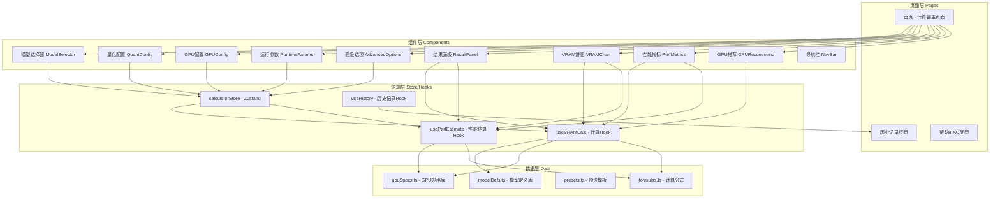

## 用户需求

基于GitHub开源项目进行二次开发，构建一个LLM显存与性能计算器网站。

## 产品概述

一个面向PC端的LLM显存（VRAM）与推理性能计算器工具网站，帮助用户估算在不同GPU硬件上运行大语言模型所需的显存及预期性能表现。界面全部为中文，UI风格对齐腾讯云官方设计语言。

## 核心功能

### 一、GitHub开源项目评选（前置工作）

从5个候选GitHub开源项目中，按功能完整度、技术栈现代性、代码质量与活跃度、UI/UX成熟度、二次开发友好度五个维度评分，选择最优项目作为二次开发基础。

**评选结果：st-lzh/vram-wuhrai**（综合评分最高 8.65/10）

- 59 Star，技术栈 Next.js 15.3 + React 19 + TypeScript + Tailwind CSS + Zustand + Framer Motion + Recharts
- 六大计算模式、130+模型数据库、智能GPU推荐、饼图可视化、历史记录
- MIT License，完善的部署方案

| 项目 | 功能完整度(25%) | 技术栈(20%) | 代码质量(15%) | UI/UX(20%) | 二次开发(20%) | 加权总分 |
| --- | --- | --- | --- | --- | --- | --- |
| st-lzh/vram-wuhrai | 9 | 9 | 8 | 9 | 8 | **8.65** |
| alexziskind1/llm-inference-calculator | 6 | 8 | 8 | 6 | 8 | 7.10 |
| jryaonj/llm-gpu-vram-calculator | 7 | 8 | 6 | 7 | 7 | 7.05 |
| deadjoe/llm-memory-calculator | 5 | 4 | 4 | 6 | 4 | 4.65 |
| SaehwanPark/llm_vram_calc | 7 | 3 | 3 | 3 | 3 | 3.80 |


### 二、核心计算功能

1. **显存估算**：基于模型架构参数（参数量、层数、隐藏维度、注意力头数、活跃专家数等）、量化方式、序列长度、批量大小，计算VRAM使用量
2. **性能模拟**：估算生成速度（TPS）、首个令牌时间（TTFT）、总吞吐量
3. **多模式支持**：推理模式与微调模式切换计算
4. **VRAM组成可视化**：饼图展示模型权重、KV Cache、激活值、优化器状态等各部分显存占比

### 三、输入配置

1. **模型选择**：下拉菜单选择预设LLM模型（130+模型库，含Qwen、DeepSeek、Llama、ChatGLM等主流系列）
2. **量化设置**：推理量化（FP16/FP8/INT8/INT4/AWQ/GPTQ）、KV缓存量化
3. **GPU配置**：选择NVIDIA GPU型号（仅NVIDIA显卡）或自定义显存大小，支持多GPU并行数量设置
4. **运行参数**：批量大小（滑块1-32）、序列长度（1K-131K）、并发用户数（滑块1-32）
5. **高级选项**：启用CPU/RAM卸载

### 四、输出结果展示

1. **显存状态**：占用百分比进度条、就绪/不足状态标签、具体数值（X GB / 共 Y GB）
2. **性能指标卡片**：生成速度、首个令牌时间、总吞吐量
3. **配置摘要**：当前模式、硬件、量化等配置的文字汇总
4. **智能GPU推荐**：根据计算结果推荐最适合的GPU型号

### 五、UI/UX要求

1. 界面全部中文显示，所有英文翻译为中文
2. UI风格对齐腾讯云官方设计语言（品牌蓝主色调、极简专业、卡片式布局）
3. 仅PC端网站，不考虑移动端适配
4. 不显示Linux、NPU等非NVIDIA GPU相关选项

### 六、辅助功能

1. 计算历史记录保存与对比
2. 配置预设模板快速选择
3. 计算原理说明文档
4. 常见问题解答（FAQ）

## 技术栈

基于 **st-lzh/vram-wuhrai** 项目进行二次开发，沿用其现有技术栈：

- **框架**: Next.js 15.3 + React 19
- **语言**: TypeScript 5.0
- **样式**: Tailwind CSS（改造为腾讯云设计风格）
- **组件库**: TDesign React（腾讯云官方设计系统，用于替换原有UI组件）
- **状态管理**: Zustand
- **动画**: Framer Motion
- **图表**: Recharts
- **构建工具**: Next.js 内置（Turbopack）

## 实现方案

### 整体策略

1. **克隆基础项目**：将 st-lzh/vram-wuhrai 克隆到工作区作为开发基础
2. **裁剪功能**：移除Linux/NPU/ARM等非NVIDIA GPU相关代码和配置、移除移动端响应式适配逻辑
3. **UI改造**：引入TDesign React组件库，将全部UI从原有Glassmorphism风格改造为腾讯云企业级风格
4. **全量中文化**：扫描并翻译所有英文文案为中文
5. **功能对齐**：对照apxml.com参考站补全性能模拟（TPS/TTFT/吞吐量）、KV缓存量化、CPU卸载等功能
6. **数据增强**：确保模型库和GPU库数据完整，过滤仅保留NVIDIA GPU

### 关键技术决策

1. **引入TDesign React组件库**：腾讯云官方设计系统，提供与腾讯云一致的UI风格、配色和交互模式，比手动模仿更精确、可维护
2. **保留Zustand状态管理**：原项目已使用Zustand，轻量且高效，无需更换
3. **保留Recharts图表库**：用于VRAM组成饼图展示，与TDesign视觉风格可兼容
4. **保留Framer Motion动画**：用于页面过渡和交互微动效，提升用户体验

### 性能考量

- 计算逻辑全部在客户端执行，无后端依赖，无网络延迟
- 使用 `useMemo` / `useCallback` 避免不必要的重复计算
- 模型数据库和GPU数据库作为静态数据内置，无需异步加载
- 滑块参数变化使用防抖处理，避免高频触发重算

## 实现注意事项

1. **TDesign集成**：安装 `tdesign-react` 和 `tdesign-icons-react`，在全局引入TDesign CSS变量和主题Token，确保与Tailwind CSS无冲突（TDesign使用CSS变量，Tailwind使用utility class，两者可以共存）
2. **中文化覆盖**：需要处理的英文包括：组件label文案、placeholder文案、tooltip说明文案、FAQ内容、计算公式说明文案、模型名称（保留英文原名）、GPU型号名称（保留英文原名）
3. **GPU数据裁剪**：从GPU数据库中移除AMD、Intel、Apple Silicon、NPU等非NVIDIA设备，仅保留NVIDIA全系列（消费级RTX/GTX、专业级A/H/L系列）
4. **向后兼容**：原项目支持的Docker部署方案保留，更新Dockerfile适配改造后的项目

## 架构设计

### 系统架构



### 数据流

用户交互（选择模型/GPU/调参） --> Zustand Store 更新 --> 触发计算 Hook 重新计算 --> 结果更新至 ResultPanel / VRAMChart / PerfMetrics --> 用户查看结果

### 模块划分

- **UI组件模块**：使用TDesign组件库重构所有表单控件（Select/Slider/Switch/Card/Tabs等）
- **计算引擎模块**：保留原项目的VRAM计算公式逻辑，补充性能估算公式
- **数据模块**：模型库、GPU库、预设模板的静态数据
- **状态管理模块**：Zustand store管理全局计算参数和结果

## 目录结构

以下为基于 st-lzh/vram-wuhrai 项目改造后的关键文件：

```
vramcalculator/
├── package.json                        # [MODIFY] 添加tdesign-react/tdesign-icons-react依赖
├── tailwind.config.ts                  # [MODIFY] 调整Tailwind配置与TDesign主题融合，添加腾讯云品牌色
├── next.config.js                      # [MODIFY] 如有需要调整Next.js配置
├── src/
│   ├── app/
│   │   ├── layout.tsx                  # [MODIFY] 全局布局改造，引入TDesign全局样式和中文字体
│   │   ├── page.tsx                    # [MODIFY] 首页计算器主页面，重构布局为腾讯云风格
│   │   ├── globals.css                 # [MODIFY] 全局样式重写，设置腾讯云配色CSS变量
│   │   ├── history/
│   │   │   └── page.tsx                # [MODIFY] 历史记录页面中文化与UI改造
│   │   └── help/
│   │       └── page.tsx                # [NEW] 帮助/FAQ页面，计算原理说明和常见问题
│   ├── components/
│   │   ├── layout/
│   │   │   ├── NavBar.tsx              # [MODIFY] 顶部导航栏改造为腾讯云风格，全中文
│   │   │   └── Footer.tsx              # [MODIFY] 页脚改造，中文化
│   │   ├── calculator/
│   │   │   ├── ModelSelector.tsx       # [MODIFY] 模型选择器改用TDesign Select组件，中文label
│   │   │   ├── QuantConfig.tsx         # [MODIFY] 量化配置面板，改用TDesign RadioGroup，中文化
│   │   │   ├── GPUConfig.tsx           # [MODIFY] GPU配置面板，过滤仅NVIDIA GPU，改用TDesign组件，中文化
│   │   │   ├── RuntimeParams.tsx       # [MODIFY] 运行参数面板（批量大小/序列长度/并发数），改用TDesign Slider，中文化
│   │   │   ├── AdvancedOptions.tsx     # [MODIFY] 高级选项面板（CPU卸载），移除Linux/NPU选项，中文化
│   │   │   └── ModeSwitch.tsx          # [MODIFY] 推理/微调模式切换，改用TDesign Tabs，中文化
│   │   ├── results/
│   │   │   ├── ResultPanel.tsx         # [MODIFY] 结果总览面板，改用TDesign Card，中文化
│   │   │   ├── VRAMChart.tsx           # [MODIFY] VRAM组成饼图，中文化图例和标签
│   │   │   ├── PerfMetrics.tsx         # [MODIFY] 性能指标展示（TPS/TTFT/吞吐量），改用TDesign组件，中文化
│   │   │   ├── VRAMStatusBar.tsx       # [MODIFY] 显存状态进度条，改用TDesign Progress，中文化
│   │   │   └── GPURecommend.tsx        # [MODIFY] GPU推荐面板，过滤仅NVIDIA，中文化
│   │   └── common/
│   │       ├── ThemeProvider.tsx        # [NEW] TDesign主题供应组件，配置腾讯云品牌色主题
│   │       └── Tooltip.tsx             # [MODIFY] 信息提示组件，中文化
│   ├── store/
│   │   └── calculatorStore.ts          # [MODIFY] 状态管理，确保中文化的状态消息
│   ├── hooks/
│   │   ├── useVRAMCalc.ts              # [MODIFY] VRAM计算hook，补充KV缓存量化计算逻辑
│   │   └── usePerfEstimate.ts          # [MODIFY] 性能估算hook，确保TPS/TTFT/吞吐量计算完整
│   ├── data/
│   │   ├── modelDefs.ts                # [MODIFY] 模型定义数据，确保130+模型完整
│   │   ├── gpuSpecs.ts                 # [MODIFY] GPU规格数据，移除非NVIDIA设备
│   │   ├── presets.ts                  # [MODIFY] 预设模板数据，中文化预设名称
│   │   └── formulas.ts                 # [MODIFY] 计算公式模块，补充性能估算公式
│   ├── lib/
│   │   └── i18n.ts                     # [NEW] 中文文案常量集中管理，所有UI文案统一存放
│   └── types/
│       └── index.ts                    # [MODIFY] TypeScript类型定义，确保完整
├── public/
│   └── favicon.ico                     # [MODIFY] 替换网站图标
└── Dockerfile                          # [MODIFY] 更新Docker配置适配改造后项目
```

## 关键代码结构

```typescript
// src/lib/i18n.ts - 中文文案集中管理
export const ZH_CN = {
  nav: {
    title: 'LLM 显存计算器',
    calculator: '计算器',
    history: '历史记录',
    help: '帮助',
  },
  model: {
    selectModel: '选择模型',
    quantization: '推理量化',
    kvCacheQuant: 'KV 缓存量化',
  },
  gpu: {
    selectGPU: '选择 GPU',
    customVRAM: '自定义显存',
    gpuCount: 'GPU 数量',
  },
  runtime: {
    batchSize: '批量大小',
    seqLength: '序列长度',
    concurrentUsers: '并发用户数',
  },
  results: {
    vramUsage: '显存使用',
    ready: '就绪',
    insufficient: '显存不足',
    tps: '生成速度 (tokens/s)',
    ttft: '首个令牌时间 (ms)',
    throughput: '总吞吐量',
  },
  // ...更多文案
} as const;
```

## 设计风格

采用腾讯云企业级设计风格，整体呈现专业、稳重、科技感的视觉体验。使用 TDesign React 组件库作为基础组件，确保与腾讯云官方页面视觉一致性。布局采用经典的双栏结构——左侧配置面板、右侧结果面板，信息层级清晰。

## 页面规划

### 第1页：计算器主页面

- **顶部导航栏**：白色背景，左侧为产品Logo和名称"LLM 显存计算器"，右侧为导航链接（计算器/历史记录/帮助）。导航栏底部有1px分割线，整体风格简洁。
- **左侧配置区域**：使用TDesign Card组件承载四个配置分组。第一组"模型配置"：包含模型选择下拉框、推理量化选择（FP16/FP8/INT8/INT4单选组）、KV缓存量化选择。第二组"硬件配置"：GPU型号下拉选择或自定义显存输入框、GPU数量步进器。第三组"运行参数"：批量大小滑块（带数值显示）、序列长度分段选择按钮（8K/16K/32K/64K/128K）、并发用户数滑块。第四组"高级选项"：可折叠面板，含CPU卸载开关。各配置组之间有16px间距，标题使用蓝色品牌色左边框装饰。
- **右侧结果区域**：顶部为显存状态条，使用TDesign Progress组件展示占用百分比，绿色表示就绪、红色表示不足。下方为三个并排指标卡片（生成速度/首个令牌时间/总吞吐量），每个卡片展示数值和单位。再下方为VRAM组成饼图，使用Recharts绘制，配色与腾讯云色系一致。底部为配置摘要文本区域和智能GPU推荐卡片。
- **模式切换**：页面顶部配置区上方使用TDesign Tabs组件实现"推理"与"微调"模式切换。

### 第2页：历史记录页面

- **顶部导航栏**：与主页一致
- **内容区域**：使用TDesign Table组件展示计算历史记录列表，包含模型名称、GPU型号、量化方式、显存用量、时间戳等列。支持行展开查看详细配置。提供清空历史按钮。
- **对比功能**：支持勾选两条记录进行侧边对比，结果在弹窗中以双列方式展示差异。

### 第3页：帮助与FAQ页面

- **顶部导航栏**：与主页一致
- **计算原理区域**：使用TDesign Card承载，分段说明显存计算公式（模型权重、KV Cache、激活值、优化器状态），配以简洁的数学公式展示。
- **FAQ区域**：使用TDesign Collapse折叠面板展示常见问题，包括计算准确性说明、MoE模型说明、与Ollama对比等。
- **参考文献**：底部列出学术参考文献链接列表。

## Agent Extensions

### Skill

- **llm-inference-advisor**
- Purpose: 在开发VRAM计算公式和性能估算逻辑时，咨询大模型推理显存计算的精确公式，确保计算引擎的准确性（如模型权重内存、KV Cache计算、不同量化方式对显存的影响、TPS/TTFT性能估算模型）
- Expected outcome: 获取经过验证的LLM推理/微调场景下的VRAM计算公式和性能估算模型

### SubAgent

- **code-explorer**
- Purpose: 在克隆st-lzh/vram-wuhrai项目后，系统性地探索项目的完整目录结构、组件关系、数据流、计算逻辑等，定位所有需要修改的文件
- Expected outcome: 产出完整的修改清单和代码架构理解